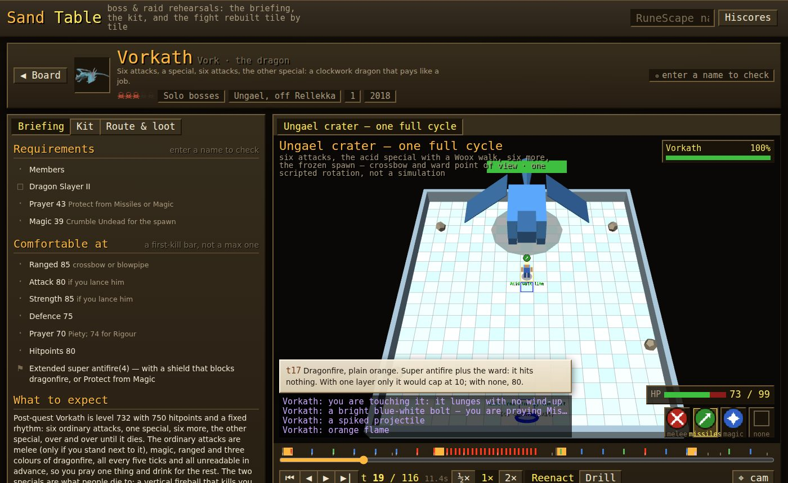

# peligaming

**Self-hosted companion tools for the games I play** — a zero-build static
site: an index page plus a folder of standalone single-file HTML tools,
deployed as a Cloudflare Worker with static assets.

Live at **[gaming.peliglot.com](https://gaming.peliglot.com)** · part of the
[peliglot](https://peliglot.com) family.

## ⚓ Naval Pathfinder

A route planner for Old School RuneScape's **Sailing** skill — pick two
points on the world map and it charts the best passage between ports,
shipwrecks, shoals and charting-task spots.

**Try it: [gaming.peliglot.com/tools/runescape/naval-pathfinder](https://gaming.peliglot.com/tools/runescape/naval-pathfinder)**


- Full sea-level world map with every named sea, port, wreck field, halibut
  shoal, port service and charting task from the wiki.
- Hazard-aware A\* routing: stormy, fetid, crystal, kelp-strewn and icy
  waters are only crossed when your ship is fitted for them; cursed,
  scalding, profane, sunbaked and cold seas are avoided outright; reefs are
  routed around unless they genuinely pay off.
- A ship's sheet: a side view of your boat where you click the hull, keel,
  helm, mast & sails, cargo hold and deck fittings to pick their tier, with
  the wiki's numbers for each — speed, hull hitpoints, armour (one point of
  damage shaved off every hit per 100), defence, and which hazard waters
  the loadout opens. Type your RuneScape name to pull Sailing and
  Construction off the hiscores and it fits the biggest boat and strongest
  parts those levels can build; slide the levels by hand otherwise.
- Route tuning from *fewest turns* to *fastest passage*, with hull-speed
  aware time estimates and a turn-by-turn sailing log.
- Right-click (or long-press) anywhere for a sail menu; tap anything to
  examine it. Type a game tile as `x, y` into From or To to sail from where
  a RuneLite location overlay says you are. Share links reproduce your exact
  view, endpoints, loadout and damage tolerance.
- Sea monsters weighed by what they can do to *your* ship: every attacker's
  max hit, attack speed and accuracy against your keel's flat armour and
  hull's defence become expected hull damage per hour in its waters, and a
  slider names the hull damage per hour you will put up with — water that
  would bleed you faster is avoided outright, slower bleeds still cost
  detours in proportion. At the default (a 1-point hit every 36 seconds)
  creatures that get one point through your armour pass, anything hitting
  for two or more reads as water to skirt, and a dragon-keel sloop sails
  straight through what can no longer scratch it (hollow studs on the
  chart). The ship's sheet lists every attacker's bite and bleed rate for
  your ship; the log says how much hull to expect to lose, at what rate,
  and to whom.
- **Courier runs** — silk roads for port tasks. Every notice board's courier
  task pool from the wiki (level, xp, cargo port, destination, crates), priced
  in coin from the port coin-bag tiers. The planner sails the same grid to
  time every port pair, then weighs every loop of up to five ports for the
  one that keeps your task slots and cargo hold earning: which tasks to
  accept, load and deliver at each call, gp/h and xp/h, the loop drawn on
  the chart. A board only ever shows eight notices — one bounty always up,
  the odd pinned courier task, the rest a random draw from its pool — so a
  lap is priced on what you can expect to find there, with the odds of each
  task and the next-best pick at every call, not on the whole pool at once.
  Set a start port to see its board's best single tasks too; tick off tasks
  your board didn't roll and it plans around them until the boards reset.

Everything runs client-side in one HTML file — no backend, no build step.

### How it's built

- `scripts/fetch-naval-data.mjs` builds the committed data from the
  [OSRS Wiki](https://oldschool.runescape.wiki): it stitches the wiki's
  rendered map tiles into `map.jpg`, learns per-sea water colours from the
  wiki's sea polygons and the Sailing hazards page, classifies every game
  tile into a navigation class, and scrapes ports, wrecks, shoals, services
  and charting tasks into `naval.json`, (via
  `scripts/lib/courier-tasks.mjs`) every notice board's courier and bounty
  task pools with the task-slot, coin-bag and cargo-hold tables the planner
  prices with, and (via `scripts/lib/ship-parts.mjs`) the boat types, the tier
  tables of every core boat part and cargo hold, and each sea monster's
  attack against a boat from the Boat combat page.
  `scripts/fetch-courier-tasks.mjs` and `scripts/fetch-ship-data.mjs`
  refresh just those blocks.
- `navcells.png` is the navigation grid — one pixel per 4×4-tile cell, the
  red channel indexing thirteen water classes (open, stormy, reefs, fetid,
  crystal, kelp, icy, plus impassable "wall" seas).
- `scripts/audit-naval-grid.py` audits the grid after a refresh (class
  histogram, connectivity, port snaps) and with `--repair` mends seas the
  colour classifier missed, absorbs landlocked pockets, and normalises
  cave-plane coordinates.
- The app itself (`public/tools/runescape/naval-pathfinder.html`) loads the
  three data files and does snapping, A\* with per-class costs and gear
  gating, rendering and UI in vanilla JS on a canvas.

To refresh the data after a game update:

```sh
node scripts/fetch-naval-data.mjs        # rebuild map.jpg / navcells.png / naval.json
python3 scripts/audit-naval-grid.py --repair   # deps: pip install pillow numpy
node scripts/fetch-courier-tasks.mjs     # or just the courier task pools (npm run data:courier)
node scripts/fetch-ship-data.mjs         # or just ship parts & monster attacks (npm run data:ship)
```

The damage model, for the curious: a boat's keel grants one flat armour per
100 armour, subtracted from every hit that lands, so a creature whose max hit
is at or below it can never dent the hull; hits roll uniformly up to the max,
and accuracy follows the standard roll of the creature's attack level against
the hull's defence level (the boats' defence bonuses are unpublished and taken
as zero). Each attacker's spawn points are rasterised into a reach scaled by
its level, summed into "how many are on you" per cell, and multiplied by its
expected damage per tick for the ship at hand, which read as hull lost per
hour of sailing that cell. The captain's tolerance turns that into a cost:
time spent in water bleeding at the tolerance counts double, at a tenth of it
a tenth more, and water bleeding faster than the tolerance climbs steeply
enough to be a wall in all but the last resort — so a raft detours around
everything, a mid ship brushes the fringe of a field where few of its hunters
reach, and a stout sloop sails straight through what can only nick it.
Harmless quarry (birds, rays, orcas) never bends a course.

The courier planner's model, for the curious: a loop is a closed walk over
ports that trade with each other; each task is pinned to the loop (accepted
at its board, loaded at its cargo port, delivered at its destination) and
holds a task slot for the legs in between, so packing tasks into slots and
hold is a small interval-packing problem solved greedily by value and by
value per slot-hour. Time is sea time between ports (a Dijkstra per port on
the navigation grid, then the real A\* per leg once a loop is chosen) plus
a tunable dockside allowance per call and per crate. Coin is the expected
coin bag (four completions in five) for the task's XP tier; the reward bag
of supplies on the fifth is left out. The wiki lists each board's full pool
(about nineteen courier and seven bounty tasks) but a board shows eight
notices: its guaranteed bounty task, any courier task the community has
found pinned to it, and a random draw from the rest — locked tasks included,
as the roll pays your level no heed — so a given task is up on roughly a
quarter of rolls. A lap's worth is therefore an expectation: every loop gets
a cheap ceiling (the whole pool at once, and every candidate task weighted by
its odds, whichever is lower), then, in ceiling order, the boards are rolled
a few dozen times for each loop and what came up is packed, until no
remaining ceiling could beat the eighth best expectation. The plan shows the
pack with every task up as what to look for, each task's odds, and the
next-best pick at each call when those aren't there.

## ⚔️ Sand Table

A bossing and raiding rehearsal tool for Old School RuneScape: every fight's
**briefing**, its **kit**, and the fight itself rebuilt tile by tile as a 3D
sand table you scrub through and then drill.

**Try it: [gaming.peliglot.com/tools/runescape/sand-table](https://gaming.peliglot.com/tools/runescape/sand-table)**



The wiki tells you what a boss does. What it can't do is show you *when*,
*where*, and *what you do about it* at the same time — so this puts each
mechanic in space and time, then turns the table around and grades you.

- **The board**: sixty-odd encounters — the three raids, the group bosses,
  every solo boss from Scurrius to the Doom of Mokhaiotl, the Slayer bosses,
  the Wilderness bosses, the Fight Caves, Inferno, Colosseum, Gauntlet,
  Barrows and Moons, and the skilling bosses — each with a portrait, a
  difficulty in skulls, the team size, and, once you type your RuneScape
  name, your kill count off the hiscores and a ready/locked pip.
- **The briefing**: requirements ticked against your hiscores levels (quests
  are a click-to-tick checklist kept in your browser), a comfortable
  first-kill bar, the boss's real numbers from the wiki's infobox (combat,
  hitpoints, max hits by style, attack speed in ticks, defensive bonuses,
  elemental weakness, immunities), the phases or rooms, and every mechanic as
  *what you see → what you do*, with a ▶ that jumps the sand table to the
  moment it happens.
- **The kit**: two or three setups per fight (one a mid-level player could
  own, one strong) laid out as the worn-equipment panel and the 4×7
  inventory with the wiki's icons; hover any item for the *why*.
- **The sand table**: the arena at tile scale in low-poly 3D — the boss and
  its adds, pillars and pools, the player and the team — with a tick clock
  (0.6 s) you play, step and scrub. Attacks fly as projectiles coloured by
  style, danger tiles glow before they land, hitsplats pop, the boss talks
  overhead, phases banner, and a coach's note narrates what is happening
  and what to do. Every scene is a scripted reenactment of one representative
  rotation, not a combat simulation.
- **Drill**: flip the mode and the guide's hands come off. Read the cue in
  the chat, hit `1`/`2`/`3` for the protection prayer before the hit lands,
  click a tile to step off the floor, `E` to eat from your kit's food, and it
  grades every attack and every floor mechanic — then lists your mistakes,
  each one a click away from watching the guide play that moment.

### How it's built

- `public/tools/runescape/sand-table.html` is the app: vanilla JS and
  three.js, no build step.
- Each encounter is one file under
  `public/tools/runescape/data/sand-table/encounters/` calling
  `SAND_TABLE.register({...})` — requirements, expectations, kit, route,
  loot, and one or more scenes (an arena, actors, and a script of events in
  game ticks). `docs/sand-table/AUTHORING.md` is the schema and the rules;
  `npm run check:sand-table` validates every file against it (tiles inside
  the arena, sorted scripts, the guide's own movement dodging every floor
  mechanic, and so on). `data/sand-table/index.js` is the roster.
- `npm run data:bosses` (`scripts/fetch-boss-data.mjs`) pulls the wiki's
  monster infoboxes for every monster the encounters name, an inventory
  icon for every item, and a portrait per encounter into `wiki.json` and
  `portraits/`, cached in `.sand-table-cache/`. Run it after adding or
  editing encounters.

## ⚔️ Sand Table

A bossing and raiding rehearsal tool for Old School RuneScape. The wiki tells
you what a boss does; the Sand Table puts the mechanic in **space and time**:
every fight is rebuilt as a tile-scale 3D diorama with a tick clock you
scrub, then turned around into a drill that grades your prayer switches and
your footwork.

**Try it: [gaming.peliglot.com/tools/runescape/sand-table](https://gaming.peliglot.com/tools/runescape/sand-table)**


- **The board.** Raids, group bosses, solo bosses, Slayer bosses, wilderness
  bosses, challenges and skilling bosses, each with a portrait, a difficulty
  in skulls, a team size and a region. Type your RuneScape name and the
  hiscores fill in your levels and your kill count at every boss; cards you
  cannot enter yet fade.
- **The briefing.** Requirements as a checklist ticked against your levels
  (quests are a click-to-tick list kept in your browser), a comfortable
  first-kill bar, the boss's own numbers from the wiki's infobox (combat,
  hitpoints, max hits by style, attack speed in ticks, size, elemental
  weakness, immunities, every defensive bonus), the phases or the raid's
  rooms, and every mechanic as **cue → response** with a ▶ that jumps the
  table to the moment it happens.
- **The kit.** Two or three setups per fight — one a mid-level player can
  own, one strong — laid out as the worn-equipment panel and the 4×7
  inventory with the wiki's own icons; hover any item for the *why*.
- **The sand table.** The arena tile by tile, the boss and its adds as
  low-poly figures, your own figure with the overhead prayer, projectiles,
  hitsplats, danger tiles and safe tiles, boss text and the chatbox, and a
  coach's note narrating each beat. A timeline of every attack, floor
  mechanic and phase; play, pause, step a tick, scrub, half or double speed.
  Click an actor to examine it.
- **The drill.** Flip the table and the guide's hands come off: read the cue
  in the chat, press <kbd>1</kbd>/<kbd>2</kbd>/<kbd>3</kbd> for the overhead,
  click a tile to step off the floor, <kbd>E</kbd> to eat from the setup's
  own food. Every attack is graded at the tick it lands; at the end a card
  says what you prayed, what you dodged, what you took, and lets you click
  any mistake to watch the guide play that moment.

Every scene is a **scripted reenactment of one representative rotation**,
not a combat simulation: the boss does what the script says, damage rolls
are illustrative, and the real fight will surprise you. That is the honest
limit of the design and it is stated on every scene.

### How it's built

- Each encounter is one file under
  `public/tools/runescape/data/sand-table/encounters/<id>.js` — the
  briefing, the kit, the loot and route, and the scenes — written to the
  schema in [`docs/sand-table/AUTHORING.md`](docs/sand-table/AUTHORING.md)
  from the wiki's strategy pages, in original prose. The roster is
  `data/sand-table/index.js`.
- `npm run check:sand-table` validates every file: tiles inside the arena,
  events in order, inventories of at most 28, and that the guide's own
  player never stands on a floor mechanic when it lands.
- `npm run data:bosses` (`scripts/fetch-boss-data.mjs`) pulls what the files
  reference from the OSRS Wiki's API into `data/sand-table/wiki.json` — every
  monster's infobox stats, an inventory icon for every item named — and a
  portrait per encounter into `data/sand-table/portraits/`. Downloads are
  cached in `.sand-table-cache/`.
- The app (`public/tools/runescape/sand-table.html`) is vanilla JS and
  three.js: a deterministic tick engine (events fire at their tick, hits
  resolve at theirs, scrubbing replays from zero), an OSRS-flavoured HUD,
  and a low-poly shape library that builds each actor from primitives.
  Hiscores lookups go through the site's existing `/api/osrs/hiscores`
  proxy.

## Other tools

| Game | Tool | What it does |
| --- | --- | --- |
| RuneScape | Sand Table | Boss & raid rehearsals: the briefing, the kit, and the fight rebuilt tile by tile in 3D with a drill mode |
| RuneScape | Sand Table | Boss and raid rehearsals: the briefing checked against your hiscores, the kit slot by slot, and the fight rebuilt tile by tile in 3D with a tick clock — then a drill that grades your prayers and footwork |
| RuneScape | Job Board | Skilling work priced by the Grand Exchange: a notice board of jobs that pay right now (or the cheapest xp in a skill), each lifting into a contract to buy, work and sell; plus a Market Board of weekly going rates with standing orders priced to fill within a day, a Commodities grid of the goods everyone trades with a GEB (Grand Exchange Basket) on every family, and an econ primer |
| RuneScape | Gielinor Crafting Web | Every craftable item as an explorable 3D recipe web, with per-skill xp lenses |
| RuneScape | Lingo Cheat Sheet | OSRS Spanish for English speakers: a searchable phrasebook of neutral international Spanish for trading, bossing, the wildy, skilling and clan chat, the game's Spanglish verbs, chat shorthand, and the regional slang that tells you where a player is from; click a phrase to copy it, or flip to chat spelling |
| Fortnite | Tactical Terrain | The island in 3D — sightlines, dead ground, cover |
| Skyrim | Enchanting Simulator | Max-enchant loadout planner |
| Skyrim | Alchemy Lab | Best-value potions from your ingredient stock |

### RuneScape data plumbing

Both economy tools draw from one canonical recipe dataset and one shared edge
cache:

- `scripts/fetch-recipes.mjs` pulls every `{{Infobox Recipe}}` from the
  [OSRS Wiki's Bucket API](https://oldschool.runescape.wiki/w/RuneScape:Bucket)
  — materials, facilities, tools, real tick counts, and xp per action — and
  writes `tools-src/runescape/recipes.json` (the Job Board's recipe graph)
  while also joining xp onto the Crafting Web's embedded data. Run it after
  game updates, then `npm run build:tools` and commit all three files.
- `src/worker.mjs` proxies the wiki price API **and** Jagex's public OSRS
  hiscores under `/api/osrs/*`, so every visitor shares one polite edge cache
  and requests carry a descriptive User-Agent (the hiscores send no CORS
  headers, so the proxy is the only browser route in). No sign-in anywhere —
  hiscores lookups are per-name and public. Finished daily blocks
  (`/24h?timestamp=`) never change, so the proxy holds each for a week.

### The Job Board

The board prices resource-processing work off the exchange itself: buy the
inputs, do the skilling, sell the product. It looks like the thing it is
named after — a parchment ledger pinned to a wooden board, one row per job:
the job in the game's own words ("Smith Cannonball"), what it needs as green
or red chips ("Smithing 35", "Dwarf Cannon"), what the batch pays, and the
four numbers a trainee compares — **xp/hr**, **gp/hr**, **gp per xp** and
**afk**, the stretch the game works on its own between your inputs. Click
any column head to re-rank. Pick **All professions** or tick the ones you
train — Smithing, Crafting, Fletching, Cooking, Herblore, Magic — and the
ledger keeps only work that pays xp in them, reading xp/hr and gp/xp
against that xp; work that costs gp but pays xp stays on the board (red)
unless "Paying only" is ticked. Tap a row and it lifts into a contract: the
requirement checklist, a batch control, the plan as BUY / WORK / SELL lines
with clocks, the facts, and at most one warning. "Start now" prices every
leg off the freshest tape (insta-buy the inputs, insta-sell the product);
"Full margin" quotes at the week's going rates for the whole margin with
about a day's wait per leg. The player's sheet (levels, members, the quests
that gate today's jobs, a RuneScape name to pull levels off the hiscores)
folds into a one-line character strip above the board, and a blank sheet
shows the whole board faded where it is out of reach rather than an empty
wall. Facilities and tools ("Furnace", "Ammo mould") are reminders, not
gates: the game doesn't track whether you own a chisel, and neither does
the board. Every recipe comes from the wiki's own data (real tick counts, xp
per action); the afk read comes from how the game takes the work — a Make-X
runs a whole inventory, a standard-spellbook cast or a grimy herb takes a
click each, a Lunar production spell runs through the inventory on one
cast — with stackable materials taking one slot for the trip. Alch jobs
price the runes off the exchange and pay the spell's fixed coin value with
no sell leg and no tax.

### The Market Board's day model

The desk reads the week, not the minute. Every row's headline is the week's
volume-weighted going rate over the last seven complete UTC days, from the
wiki's bulk daily endpoint (seven cacheable requests for the whole exchange),
with the trend, the week's range, a typical day's after-tax spread, and the
gp the book moves a day (units × rate, the board's rank) beside it. Every
column takes a min and a max — typed or dragged — with presets for the usual
screens. Tap an item and the desk fetches its hourly tape for the last fortnight
and prices two standing orders off it: for each of the last seven days, the
cheapest price at which a standing buy could have filled your quantity (the
day's hours sorted from the cheapest insta-sell average upward, accumulating
half of each hour's flow as yours), and the dearest at which a standing sell
could have; the orders are the prices that would have filled on all but one
of those days (or every day, or all but two). Each order is read against
the week's going rate as a percentage; a chart draws both lines across the
week, with the going rate between them, so you can see the cycle touch them;
an hour-of-day profile says
when the dips and peaks usually land, and a holdout check fits the same rule
to the week before and reports how often it held on the week after.

The pure model lives in `tools-src/runescape/day-model.js`;
`npm run check:model [itemId] [qty]` prints its read on one item against the
live API. `npm run data:snapshot` re-bakes the offline snapshot with the
week's daily rows.

### The Commodities tab and its GEBs

The goods everyone trades — ores, bars, logs, planks, hides, fish, herbs,
runes and ammo — laid out as material families by processing stage (raw,
refined, product), with a **GEB** on every family, every stage and the whole
grid. A GEB, a Grand Exchange Basket, is a fixed load of goods priced at each
day's volume-weighted going rate and set to 100 where the window starts, so
104 reads "the same load costs 4% more than it did". *By flow* weights each
good by the units it trades on a typical day, fixed for the window so a
riser can't vote itself heavier: the basket is the cost of a typical day's
flow through that family. *Equal* is the geometric mean of every good's
move: what the typical good is doing. Both are chain-linked day by day over
whichever goods have a price on both days, so a thin day or a young book
shifts the level by its own move and never by its absence; a price is
carried across a gap of up to seven days.

The week the board already holds draws the grid at once; a year of daily
history per good streams in behind it (one wiki `timeseries` request each,
six at a time, only while the tab is open, cached a quarter hour at the
edge) and fills in the chart, the moves and the flags. The chart draws every
basket on one axis, rebased to 100, with Wednesday game updates marked, a
crosshair that reads every line at a date, and a table twin. Each good's row
carries its going rate, its move across the window, that move less its
family's ("vs family"), a sparkline, and a ⚑ when today's price or volume
sits more than two standard deviations from its last ninety days. A
**Linked pairs** table prices the recipes that tie goods together — logs to
planks with the sawmill's fee, ore and coal to bars, a steel bar to four
cannonballs, hides to leather, raw fish to cooked, grimy herbs to clean to
potions — as what one action makes over what it costs, against the ratio's
usual band: a ratio well outside it is either a job just opened on the Job
Board or a market that has changed shape.

The curated grid and pairs live in `tools-src/runescape/baskets.js`, the
maths in `tools-src/runescape/basket-model.js`, and
`npm run check:baskets [family] [days]` reads one family's GEB live.

## Repository structure

```
peligaming/
  wrangler.jsonc          Cloudflare Worker config (static assets only)
  public/                 Everything in here is served as-is
    index.html            The tools index (renders from tools.js)
    tools.js              Tool manifest — edit when adding a tool
    tools/<game>/         One folder per game; standalone tool HTML + data
  tools-src/              React (.jsx) tool sources, bundled by build:tools
  scripts/                Data pipelines and the tool bundler
```

Deploys are zero-build: `public/` is served verbatim and built tool HTML is
committed. The only build step is local, when a React tool changes.

### Adding a tool

1. Get the tool file in place:
   - **Plain HTML tool**: save it as `public/tools/<game>/<tool-name>.html`.
   - **React/JSX tool**: save the source under `tools-src/<game>/`, add an
     entry to the `TOOLS` list in `scripts/build-tools.mjs`, then run
     `npm install` (first time) and `npm run build:tools`. Commit both the
     source and the built HTML.
2. Add an entry to that game's `tools` array in `public/tools.js`.

### Local preview

```sh
npx wrangler dev          # exact Cloudflare behavior, includes 404 handling
# or
python3 -m http.server -d public
```

### Deploy

```sh
npx wrangler deploy
```

Serves at `gaming.peliglot.com` (or `peligaming.<your-subdomain>.workers.dev`
on a fresh account — adjust the `routes` block in `wrangler.jsonc`).

## Licensing & attribution

Three kinds of things live here under different terms — see
[LICENSE](LICENSE) for the full text:

- **Code** (the tools, scripts, worker and site chrome) is **MIT**.
- **Game data** derived from the
  [Old School RuneScape Wiki](https://oldschool.runescape.wiki)
  (`naval.json`, `navcells.png`, the Sand Table's `wiki.json`) is
  **[CC BY-NC-SA 3.0](https://creativecommons.org/licenses/by-nc-sa/3.0/)**,
  the same license as the wiki content it comes from.
- **Game imagery** (`map.jpg`, rendered from the game's world map; the Sand
  Table's item icons and monster portraits) is the
  intellectual property of Jagex Limited, used non-commercially under
  [Jagex's Fan Content Policy](https://legal.jagex.com/docs/policies/fan-content-policy).
  Material relating to other games belongs to their respective owners.

> Created using intellectual property belonging to Jagex Limited under the
> terms of Jagex's Fan Content Policy. This content is not endorsed by or
> affiliated with Jagex.
