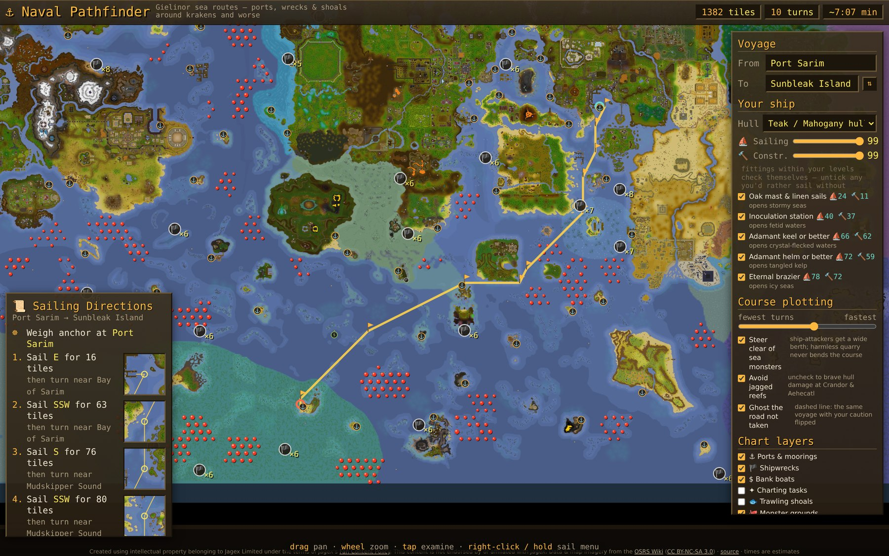

# peligaming

**Self-hosted companion tools for the games I play** — a zero-build static
site: an index page plus a folder of standalone single-file HTML tools,
deployed as a Cloudflare Worker with static assets.

Live at **[gaming.peliglot.com](https://gaming.peliglot.com)** · part of the
[peliglot](https://peliglot.com) family.

## ⚓ Naval Pathfinder

A route planner for Old School RuneScape's **Sailing** skill — pick two
points on the world map and it charts the best passage between ports,
shipwrecks, shoals and charting-task spots.

**Try it: [gaming.peliglot.com/tools/runescape/naval-pathfinder](https://gaming.peliglot.com/tools/runescape/naval-pathfinder)**



- Full sea-level world map with every named sea, port, wreck field, halibut
  shoal, port service and charting task from the wiki.
- Hazard-aware A\* routing: stormy, fetid, crystal, kelp-strewn and icy
  waters are only crossed when your ship is fitted for them; cursed,
  scalding, profane, sunbaked and cold seas are avoided outright; reefs are
  routed around unless they genuinely pay off.
- A ship's sheet: a side view of your boat where you click the hull, keel,
  helm, mast & sails, cargo hold and deck fittings to pick their tier, with
  the wiki's numbers for each — speed, hull hitpoints, armour (one point of
  damage shaved off every hit per 100), defence, and which hazard waters
  the loadout opens. Type your RuneScape name to pull Sailing and
  Construction off the hiscores and it fits the biggest boat and strongest
  parts those levels can build; slide the levels by hand otherwise.
- Route tuning from *fewest turns* to *fastest passage*, with hull-speed
  aware time estimates and a turn-by-turn sailing log.
- Right-click (or long-press) anywhere for a sail menu; tap anything to
  examine it. Type a game tile as `x, y` into From or To to sail from where
  a RuneLite location overlay says you are. Share links reproduce your exact
  view, endpoints, loadout and damage tolerance.
- Sea monsters weighed by what they can do to *your* ship: every attacker's
  max hit, attack speed and accuracy against your keel's flat armour and
  hull's defence become expected hull damage per hour in its waters, and a
  slider names the hull damage per hour you will put up with — water that
  would bleed you faster is avoided outright, slower bleeds still cost
  detours in proportion. At the default (a 1-point hit every 36 seconds)
  creatures that get one point through your armour pass, anything hitting
  for two or more reads as water to skirt, and a dragon-keel sloop sails
  straight through what can no longer scratch it (hollow studs on the
  chart). The ship's sheet lists every attacker's bite and bleed rate for
  your ship; the log says how much hull to expect to lose, at what rate,
  and to whom.
- **Courier runs** — silk roads for port tasks. Every notice board's courier
  task pool from the wiki (level, xp, cargo port, destination, crates), priced
  in coin from the port coin-bag tiers. The planner sails the same grid to
  time every port pair, then weighs every loop of up to five ports for the
  one that keeps your task slots and cargo hold earning: which tasks to
  accept, load and deliver at each call, gp/h and xp/h, the loop drawn on
  the chart. A board only ever shows eight notices — one bounty always up,
  the odd pinned courier task, the rest a random draw from its pool — so a
  lap is priced on what you can expect to find there, with the odds of each
  task and the next-best pick at every call, not on the whole pool at once.
  Set a start port to see its board's best single tasks too; tick off tasks
  your board didn't roll and it plans around them until the boards reset.

Everything runs client-side in one HTML file — no backend, no build step.

### How it's built

- `scripts/fetch-naval-data.mjs` builds the committed data from the
  [OSRS Wiki](https://oldschool.runescape.wiki): it stitches the wiki's
  rendered map tiles into `map.jpg`, learns per-sea water colours from the
  wiki's sea polygons and the Sailing hazards page, classifies every game
  tile into a navigation class, and scrapes ports, wrecks, shoals, services
  and charting tasks into `naval.json`, (via
  `scripts/lib/courier-tasks.mjs`) every notice board's courier and bounty
  task pools with the task-slot, coin-bag and cargo-hold tables the planner
  prices with, and (via `scripts/lib/ship-parts.mjs`) the boat types, the tier
  tables of every core boat part and cargo hold, and each sea monster's
  attack against a boat from the Boat combat page.
  `scripts/fetch-courier-tasks.mjs` and `scripts/fetch-ship-data.mjs`
  refresh just those blocks.
- `navcells.png` is the navigation grid — one pixel per 4×4-tile cell, the
  red channel indexing thirteen water classes (open, stormy, reefs, fetid,
  crystal, kelp, icy, plus impassable "wall" seas), the green channel marking
  cells the game client's own collision data vouched for.
- `scripts/lib/collision-seed.mjs` corrects the colour classifier against
  that collision data: the [Chart Plotter](https://github.com/Dazuzi/chart-plotter)
  RuneLite plugin captures the client's collision flags as its users sail and
  ships the capture as a seed (BSD-2-Clause, see
  [THIRD_PARTY_NOTICES.md](THIRD_PARTY_NOTICES.md)). Wherever the seed is
  certain it wins — map labels and over-eroded coastlines the classifier had
  read as land become water, water it painted over solid rock becomes land —
  under the same 2-tile clearance rule the classifier uses; the void beyond
  the map edge, which the client reports as open, is exempt. The fetch
  script applies it on every rebuild; `scripts/merge-collision-seed.mjs`
  (`npm run data:collision`) re-applies it to the committed grid, for when
  the seed's pinned commit is bumped.
- `scripts/audit-naval-grid.py` audits the grid after a refresh (class
  histogram, connectivity, port snaps) and with `--repair` mends seas the
  colour classifier missed, absorbs landlocked pockets, and normalises
  cave-plane coordinates. It never repaints a collision-verified cell.
- The app itself (`public/tools/runescape/naval-pathfinder.html`) loads the
  three data files and does snapping, A\* with per-class costs and gear
  gating, rendering and UI in vanilla JS on a canvas.

To refresh the data after a game update:

```sh
node scripts/fetch-naval-data.mjs        # rebuild map.jpg / navcells.png / naval.json (applies the collision seed)
python3 scripts/audit-naval-grid.py --repair   # deps: pip install pillow numpy
node scripts/merge-collision-seed.mjs    # or re-apply just the collision seed (npm run data:collision)
node scripts/fetch-courier-tasks.mjs     # or just the courier task pools (npm run data:courier)
node scripts/fetch-ship-data.mjs         # or just ship parts & monster attacks (npm run data:ship)
```

The damage model, for the curious: a boat's keel grants one flat armour per
100 armour, subtracted from every hit that lands, so a creature whose max hit
is at or below it can never dent the hull; hits roll uniformly up to the max,
and accuracy follows the standard roll of the creature's attack level against
the hull's defence level (the boats' defence bonuses are unpublished and taken
as zero). Each attacker's spawn points are rasterised into a reach scaled by
its level, summed into "how many are on you" per cell, and multiplied by its
expected damage per tick for the ship at hand, which read as hull lost per
hour of sailing that cell. The captain's tolerance turns that into a cost:
time spent in water bleeding at the tolerance counts double, at a tenth of it
a tenth more, and water bleeding faster than the tolerance climbs steeply
enough to be a wall in all but the last resort — so a raft detours around
everything, a mid ship brushes the fringe of a field where few of its hunters
reach, and a stout sloop sails straight through what can only nick it.
Harmless quarry (birds, rays, orcas) never bends a course.

The courier planner's model, for the curious: a loop is a closed walk over
ports that trade with each other; each task is pinned to the loop (accepted
at its board, loaded at its cargo port, delivered at its destination) and
holds a task slot for the legs in between, so packing tasks into slots and
hold is a small interval-packing problem solved greedily by value and by
value per slot-hour. Time is sea time between ports (a Dijkstra per port on
the navigation grid, then the real A\* per leg once a loop is chosen) plus
a tunable dockside allowance per call and per crate. Coin is the expected
coin bag (four completions in five) for the task's XP tier; the reward bag
of supplies on the fifth is left out. The wiki lists each board's full pool
(about nineteen courier and seven bounty tasks) but a board shows eight
notices: its guaranteed bounty task, any courier task the community has
found pinned to it, and a random draw from the rest — locked tasks included,
as the roll pays your level no heed — so a given task is up on roughly a
quarter of rolls. A lap's worth is therefore an expectation: every loop gets
a cheap ceiling (the whole pool at once, and every candidate task weighted by
its odds, whichever is lower), then, in ceiling order, the boards are rolled
a few dozen times for each loop and what came up is packed, until no
remaining ceiling could beat the eighth best expectation. The plan shows the
pack with every task up as what to look for, each task's odds, and the
next-best pick at each call when those aren't there.

## Other tools

| Game | Tool | What it does |
| --- | --- | --- |
| RuneScape | Flip Desk | Live Grand Exchange market board, job board (skilling work priced by the market, or ranked by gp/xp for training), econ primer |
| RuneScape | Gielinor Crafting Web | Every craftable item as an explorable 3D recipe web, with per-skill xp lenses |
| Fortnite | Tactical Terrain | The island in 3D — sightlines, dead ground, cover |
| Skyrim | Enchanting Simulator | Max-enchant loadout planner |
| Skyrim | Alchemy Lab | Best-value potions from your ingredient stock |

### RuneScape data plumbing

Both economy tools draw from one canonical recipe dataset and one shared edge
cache:

- `scripts/fetch-recipes.mjs` pulls every `{{Infobox Recipe}}` from the
  [OSRS Wiki's Bucket API](https://oldschool.runescape.wiki/w/RuneScape:Bucket)
  — materials, facilities, tools, real tick counts, and xp per action — and
  writes `tools-src/runescape/recipes.json` (the Flip Desk Job Board's graph)
  while also joining xp onto the Crafting Web's embedded data. Run it after
  game updates, then `npm run build:tools` and commit all three files.
- `src/worker.mjs` proxies the wiki price API **and** Jagex's public OSRS
  hiscores under `/api/osrs/*`, so every visitor shares one polite edge cache
  and requests carry a descriptive User-Agent (the hiscores send no CORS
  headers, so the proxy is the only browser route in). No sign-in anywhere —
  hiscores lookups are per-name and public.

## Repository structure

```
peligaming/
  wrangler.jsonc          Cloudflare Worker config (static assets only)
  public/                 Everything in here is served as-is
    index.html            The tools index (renders from tools.js)
    tools.js              Tool manifest — edit when adding a tool
    tools/<game>/         One folder per game; standalone tool HTML + data
  tools-src/              React (.jsx) tool sources, bundled by build:tools
  scripts/                Data pipelines and the tool bundler
```

Deploys are zero-build: `public/` is served verbatim and built tool HTML is
committed. The only build step is local, when a React tool changes.

### Adding a tool

1. Get the tool file in place:
   - **Plain HTML tool**: save it as `public/tools/<game>/<tool-name>.html`.
   - **React/JSX tool**: save the source under `tools-src/<game>/`, add an
     entry to the `TOOLS` list in `scripts/build-tools.mjs`, then run
     `npm install` (first time) and `npm run build:tools`. Commit both the
     source and the built HTML.
2. Add an entry to that game's `tools` array in `public/tools.js`.

### Local preview

```sh
npx wrangler dev          # exact Cloudflare behavior, includes 404 handling
# or
python3 -m http.server -d public
```

### Deploy

```sh
npx wrangler deploy
```

Serves at `gaming.peliglot.com` (or `peligaming.<your-subdomain>.workers.dev`
on a fresh account — adjust the `routes` block in `wrangler.jsonc`).

## Licensing & attribution

Three kinds of things live here under different terms — see
[LICENSE](LICENSE) for the full text:

- **Code** (the tools, scripts, worker and site chrome) is **MIT**.
- **Game data** derived from the
  [Old School RuneScape Wiki](https://oldschool.runescape.wiki)
  (`naval.json`, `navcells.png`) is
  **[CC BY-NC-SA 3.0](https://creativecommons.org/licenses/by-nc-sa/3.0/)**,
  the same license as the wiki content it comes from. The navigation grid
  is additionally corrected against the
  [Chart Plotter](https://github.com/Dazuzi/chart-plotter) RuneLite plugin's
  collision seed, **BSD-2-Clause** — notice in
  [THIRD_PARTY_NOTICES.md](THIRD_PARTY_NOTICES.md).
- **Game imagery** (`map.jpg`, rendered from the game's world map) is the
  intellectual property of Jagex Limited, used non-commercially under
  [Jagex's Fan Content Policy](https://legal.jagex.com/docs/policies/fan-content-policy).
  Material relating to other games belongs to their respective owners.

> Created using intellectual property belonging to Jagex Limited under the
> terms of Jagex's Fan Content Policy. This content is not endorsed by or
> affiliated with Jagex.
