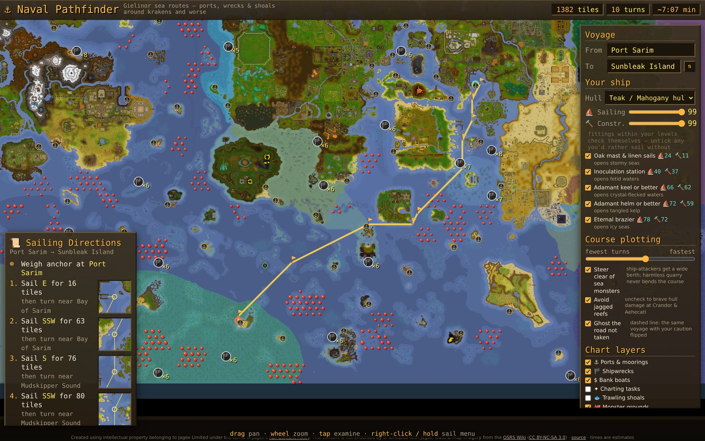
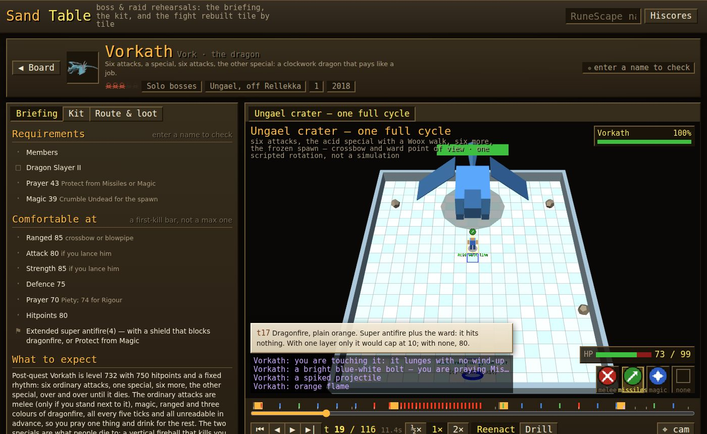
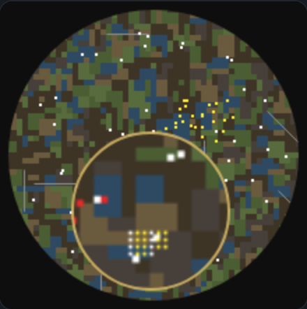
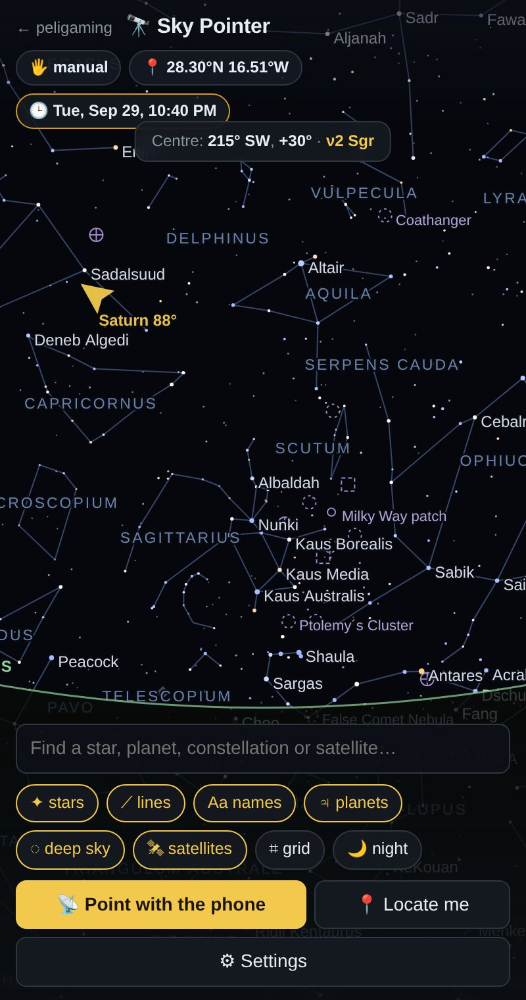
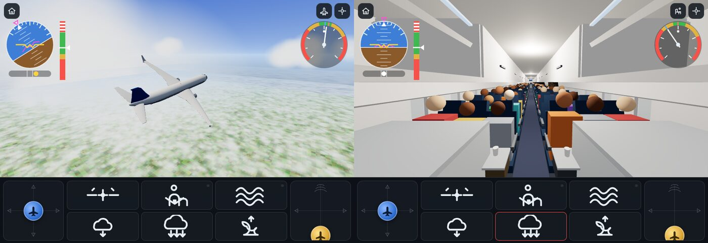

# peligaming

**Self-hosted companion tools for the games I play** — a zero-build static
site: an index page plus a folder of standalone single-file HTML tools,
deployed as a Cloudflare Worker with static assets.

Live at **[peligaming.com](https://peligaming.com)** · part of the
[peliglot](https://peliglot.com) family.

## 🗺️ World Map (WoW Forever)

The first tool for **World of Warcraft: Forever**, Blizzard's permanent
Classic-plus: Azeroth from the whole world down to a city street, drawn from
the game's own map art, with the layers the game does not draw for you.

**Try it: [peligaming.com/tools/wow-forever/world-map](https://peligaming.com/tools/wow-forever/world-map)**

- **One map at every scale.** The world map, the two continents, every zone
  (Forever's Riverglades, Mount Hyjal and Shen'dralas included, and Zephras
  Isle as an inset, since it floats in Skywall rather than on Azeroth) and
  the six capitals, each placed by the client's own coordinate assignments
  so they stitch into one continuous map: zoom from the Maelstrom to a
  Stormwind canal and the art switches under you. Zone shapes come from the
  game's "explored subzone" overlays, so every zone and every subzone is a
  real outline you can hover, and the in-game coordinates read out as you
  move.
- **Biomes.** Forever's zone-bound item effects ("Restores an additional 6
  Mana per 5 sec in Forest and Grassland areas") are gated on eight area
  groups in the client — Forest & Grassland, Swamp, Wasteland, Snowy,
  Mountainous, Haunted, Cavernous & Underground, Desert — and a zone can be
  in several (Dun Morogh is Forest, Snowy and Mountainous at once). The map
  shows no biome until you pick one; then only that biome's zones light up,
  with the subzone exceptions marked (Booty Bay counts as Forest & Grassland
  inside a Stranglethorn that does not), and the panel lists every effect
  and item that keys off it: the Darkspear Raiders' seals, the Runes of
  Perfection and Duty, the Royal Seal of Eldre'Thalas variants, and the
  rest. An "all biomes, striped" view paints every zone by all its groups.
- **Flight masters and flight paths.** Every taxi node with its faction,
  every route with its fare and its flight time (the path's length at 30
  yards a second, which matches recorded Classic flights within a few
  seconds), and a planner that strings hops together the way the game does,
  by time, for the faction you pick.
- **Boats, zeppelins and skyships.** Every transport path in the client —
  the vanilla boats and zeppelins plus Forever's new Stormwind Harbor to
  Auberdine ship, the Riverglades to Tanaris ship, the Menethil boat that now
  calls at Southshore, and the two Zephras Isle skyships — named by their
  docks (Ratchet ⇄ Booty Bay, with the vessel as a detail and each dock's
  zone and continent spelled out), with sailing time per leg, the wait at
  each dock, and the full loop. The stretches a vessel really sails are
  drawn solid along its real path; the instant crossings between continents
  are dashed, and bundled into shared cables that fan out to their docks, so
  a dozen crossings read as a few lanes rather than a web across the
  Maelstrom.
- **Banks and auction houses.** Every banker and auctioneer, coloured by who
  can use them, from zone zoom in.
- Search across zones, subzones, towns, dungeons, flight masters, ships and
  NPCs; a faction filter; share links that reproduce the view and layers.

### How it's built

- `scripts/fetch-wow-forever-map.mjs` (`npm run data:wow-forever`) builds
  everything from the Forever beta client's own data as datamined by
  [wago.tools](https://wago.tools): the UiMap tables that place each map in
  world coordinates, the map art tiles (BLP textures, decoded by
  `scripts/lib/blp.mjs` and stitched into one JPEG per map, with every
  "explored area" overlay composited on top, since the tiles alone are the
  washed-out unexplored art), the same overlays traced into zone and subzone
  polygons by `scripts/lib/contour.mjs`, the taxi nodes and paths, the
  transport paths, points of interest, the area groups behind each biome and
  the spells and items that require them. Downloads are cached in
  `.wow-forever-cache/`; pass a build number to target a newer beta.
- NPC positions come from two places, neither of them a website: the
  vanilla 1.12 spawn table of the
  [CMaNGOS classic database](https://github.com/cmangos/classic-db) (GPLv3)
  for every banker, auctioneer and flight master that already existed, with
  its faction template read against the client's FactionTemplate table for
  who it is hostile to; and `scripts/data/wow-forever/npcs-observed.json`
  for what Forever adds or moves, noted in the game itself (below).
- Sailing times are modelled from each route's spline with the vessels'
  speed and acceleration from the vanilla gameobject data (continent
  crossings and the loop's closing leg are jumps); against the vanilla
  timetables the model runs within about 5%. The crossings are bundled by
  `scripts/lib/bundle.mjs`, a force-directed edge bundling (Holten & van
  Wijk) that pulls crossings running the same way onto shared cables and
  spreads the members of a cable into lanes.
- The app (`public/tools/wow-forever/world-map.html`) is vanilla JS on a
  canvas: the art is drawn coarse to fine as you zoom, each zone clipped to
  its own outline so neighbours never fight, and every layer is vector on
  top.

### Adding an NPC

Forever's new service NPCs, and any the beta moves, are not in the vanilla
spawn table. Stand next to one in the game, target it, and run this macro:

```
/run local m=C_Map.GetBestMapForUnit("player") local p=C_Map.GetPlayerMapPosition(m,"player") print(format("%s · map %d · %.2f, %.2f",UnitName("target") or "no target",m,p.x*100,p.y*100))
```

It prints the NPC's name, the zone map's id and your position on that map,
which is within a step or two of the NPC's. Add an entry to
`scripts/data/wow-forever/npcs-observed.json`:

```json
{ "name": "Auctioneer Wabang", "roles": ["auctioneer"], "react": [-1, 1], "uiMap": 1411, "x": 52.3, "y": 45.1 }
```

`roles` is any of `banker`, `auctioneer`, `flightmaster`; `react` is
`[Alliance, Horde]` with `1` friendly, `0` neutral, `-1` hostile. An entry
whose name matches a vanilla NPC replaces that NPC's position; anything
else is added. Rebuild with `npm run data:wow-forever`.

### Sources and their terms

- **wago.tools** publishes no usage policy. The build script behaves like a
  considerate client: it identifies itself (`peligaming-map-build/1.0`, with
  a link here), fetches one file at a time with a gap between requests,
  backs off on rate limiting, and caches every download so a rebuild of the
  same build touches the network only for what is missing. Other community
  tools draw on the same endpoints the same way.
- **CMaNGOS classic-db** is GPLv3; the spawn coordinates this map derives
  from it are credited in the map's own panel and here.
- **Wowhead** is not used. Its terms bar reaching the site with anything
  but an ordinary browser and bar derivative works of its content, so the
  earlier Wowhead-sourced NPC positions were dropped and replaced by the
  sources above.
- Blizzard's fan-content terms allow non-commercial fan maps that carry the
  proper notices, which the map and `LICENSE` do.

## ⚓ Naval Pathfinder

A route planner for Old School RuneScape's **Sailing** skill — pick two
points on the world map and it charts the best passage between ports,
shipwrecks, shoals and charting-task spots.

**Try it: [peligaming.com/tools/runescape/naval-pathfinder](https://peligaming.com/tools/runescape/naval-pathfinder)**



- Full sea-level world map with every named sea, port, wreck field, halibut
  shoal, port service and charting task from the wiki.
- Hazard-aware A\* routing: stormy, fetid, crystal, kelp-strewn and icy
  waters are only crossed when your ship is fitted for them; cursed,
  scalding, profane, sunbaked and cold seas are avoided outright; reefs are
  routed around unless they genuinely pay off.
- A ship's sheet: a side view of your boat where you click the hull, keel,
  helm, mast & sails, cargo hold and deck fittings to pick their tier, with
  the wiki's numbers for each — speed, hull hitpoints, armour (one point of
  damage shaved off every hit per 100), defence, and which hazard waters
  the loadout opens. Type your RuneScape name to pull Sailing and
  Construction off the hiscores and it fits the biggest boat and strongest
  parts those levels can build; slide the levels by hand otherwise.
- Route tuning from *fewest turns* to *fastest passage*, with hull-speed
  aware time estimates and a turn-by-turn sailing log.
- Right-click (or long-press) anywhere for a sail menu; tap anything to
  examine it. Type a game tile as `x, y` into From or To to sail from where
  a RuneLite location overlay says you are. Share links reproduce your exact
  view, endpoints, loadout and damage tolerance.
- Sea monsters weighed by what they can do to *your* ship: every attacker's
  max hit, attack speed and accuracy against your keel's flat armour and
  hull's defence become expected hull damage per hour in its waters, and a
  slider names the hull damage per hour you will put up with — water that
  would bleed you faster is avoided outright, slower bleeds still cost
  detours in proportion. At the default (a 1-point hit every 36 seconds)
  creatures that get one point through your armour pass, anything hitting
  for two or more reads as water to skirt, and a dragon-keel sloop sails
  straight through what can no longer scratch it (hollow studs on the
  chart). The ship's sheet lists every attacker's bite and bleed rate for
  your ship; the log says how much hull to expect to lose, at what rate,
  and to whom.
- **Courier runs** — silk roads for port tasks. Every notice board's courier
  task pool from the wiki (level, xp, cargo port, destination, crates), priced
  in coin from the port coin-bag tiers. The planner sails the same grid to
  time every port pair, then weighs every loop of up to five ports for the
  one that keeps your task slots and cargo hold earning: which tasks to
  accept, load and deliver at each call, gp/h and xp/h, the loop drawn on
  the chart. A board only ever shows eight notices — one bounty always up,
  the odd pinned courier task, the rest a random draw from its pool — so a
  lap is priced on what you can expect to find there, with the odds of each
  task and the next-best pick at every call, not on the whole pool at once.
  Set a start port to see its board's best single tasks too; tick off tasks
  your board didn't roll and it plans around them until the boards reset.

Everything runs client-side in one HTML file — no backend, no build step.

### How it's built

- `scripts/fetch-naval-data.mjs` builds the committed data from the
  [OSRS Wiki](https://oldschool.runescape.wiki): it stitches the wiki's
  rendered map tiles into `map.jpg`, learns per-sea water colours from the
  wiki's sea polygons and the Sailing hazards page, classifies every game
  tile into a navigation class, and scrapes ports, wrecks, shoals, services
  and charting tasks into `naval.json`, (via
  `scripts/lib/courier-tasks.mjs`) every notice board's courier and bounty
  task pools with the task-slot, coin-bag and cargo-hold tables the planner
  prices with, and (via `scripts/lib/ship-parts.mjs`) the boat types, the tier
  tables of every core boat part and cargo hold, and each sea monster's
  attack against a boat from the Boat combat page.
  `scripts/fetch-courier-tasks.mjs` and `scripts/fetch-ship-data.mjs`
  refresh just those blocks.
- `navcells.png` is the navigation grid — one pixel per 4×4-tile cell, the
  red channel indexing thirteen water classes (open, stormy, reefs, fetid,
  crystal, kelp, icy, plus impassable "wall" seas).
- `scripts/audit-naval-grid.py` audits the grid after a refresh (class
  histogram, connectivity, port snaps) and with `--repair` mends seas the
  colour classifier missed, absorbs landlocked pockets, and normalises
  cave-plane coordinates.
- The app itself (`public/tools/runescape/naval-pathfinder.html`) loads the
  three data files and does snapping, A\* with per-class costs and gear
  gating, rendering and UI in vanilla JS on a canvas.

To refresh the data after a game update:

```sh
node scripts/fetch-naval-data.mjs        # rebuild map.jpg / navcells.png / naval.json
python3 scripts/audit-naval-grid.py --repair   # deps: pip install pillow numpy
node scripts/fetch-courier-tasks.mjs     # or just the courier task pools (npm run data:courier)
node scripts/fetch-ship-data.mjs         # or just ship parts & monster attacks (npm run data:ship)
```

The damage model, for the curious: a boat's keel grants one flat armour per
100 armour, subtracted from every hit that lands, so a creature whose max hit
is at or below it can never dent the hull; hits roll uniformly up to the max,
and accuracy follows the standard roll of the creature's attack level against
the hull's defence level (the boats' defence bonuses are unpublished and taken
as zero). Each attacker's spawn points are rasterised into a reach scaled by
its level, summed into "how many are on you" per cell, and multiplied by its
expected damage per tick for the ship at hand, which read as hull lost per
hour of sailing that cell. The captain's tolerance turns that into a cost:
time spent in water bleeding at the tolerance counts double, at a tenth of it
a tenth more, and water bleeding faster than the tolerance climbs steeply
enough to be a wall in all but the last resort — so a raft detours around
everything, a mid ship brushes the fringe of a field where few of its hunters
reach, and a stout sloop sails straight through what can only nick it.
Harmless quarry (birds, rays, orcas) never bends a course.

The courier planner's model, for the curious: a loop is a closed walk over
ports that trade with each other; each task is pinned to the loop (accepted
at its board, loaded at its cargo port, delivered at its destination) and
holds a task slot for the legs in between, so packing tasks into slots and
hold is a small interval-packing problem solved greedily by value and by
value per slot-hour. Time is sea time between ports (a Dijkstra per port on
the navigation grid, then the real A\* per leg once a loop is chosen) plus
a tunable dockside allowance per call and per crate. Coin is the expected
coin bag (four completions in five) for the task's XP tier; the reward bag
of supplies on the fifth is left out. The wiki lists each board's full pool
(about nineteen courier and seven bounty tasks) but a board shows eight
notices: its guaranteed bounty task, any courier task the community has
found pinned to it, and a random draw from the rest — locked tasks included,
as the roll pays your level no heed — so a given task is up on roughly a
quarter of rolls. A lap's worth is therefore an expectation: every loop gets
a cheap ceiling (the whole pool at once, and every candidate task weighted by
its odds, whichever is lower), then, in ceiling order, the boards are rolled
a few dozen times for each loop and what came up is packed, until no
remaining ceiling could beat the eighth best expectation. The plan shows the
pack with every task up as what to look for, each task's odds, and the
next-best pick at each call when those aren't there.

## ⚔️ Sand Table

A bossing and raiding rehearsal tool for Old School RuneScape: every fight's
**briefing**, its **kit**, and the fight itself rebuilt tile by tile as a 3D
sand table you scrub through and then drill.

**Try it: [peligaming.com/tools/runescape/sand-table](https://peligaming.com/tools/runescape/sand-table)**



The wiki tells you what a boss does. What it can't do is show you *when*,
*where*, and *what you do about it* at the same time — so this puts each
mechanic in space and time, then turns the table around and grades you.

- **The board**: sixty-odd encounters — the three raids, the group bosses,
  every solo boss from Scurrius to the Doom of Mokhaiotl, the Slayer bosses,
  the Wilderness bosses, the Fight Caves, Inferno, Colosseum, Gauntlet,
  Barrows and Moons, and the skilling bosses — each with a portrait, a
  difficulty in skulls, the team size, and, once you type your RuneScape
  name, your kill count off the hiscores and a ready/locked pip.
- **The briefing**: requirements ticked against your hiscores levels (quests
  are a click-to-tick checklist kept in your browser), a comfortable
  first-kill bar, the boss's real numbers from the wiki's infobox (combat,
  hitpoints, max hits by style, attack speed in ticks, defensive bonuses,
  elemental weakness, immunities), the phases or rooms, and every mechanic as
  *what you see → what you do*, with a ▶ that jumps the sand table to the
  moment it happens.
- **The kit**: two or three setups per fight (one a mid-level player could
  own, one strong) laid out as the worn-equipment panel and the 4×7
  inventory with the wiki's icons; hover any item for the *why*.
- **The sand table**: the arena at tile scale in low-poly 3D — the boss and
  its adds, pillars and pools, the player and the team — with a tick clock
  (0.6 s) you play, step and scrub. Attacks fly as projectiles coloured by
  style, danger tiles glow before they land, hitsplats pop, the boss talks
  overhead, phases banner, and a coach's note narrates what is happening
  and what to do. Every scene is a scripted reenactment of one representative
  rotation, not a combat simulation.
- **Drill**: flip the mode and the guide's hands come off. Read the cue in
  the chat, hit `1`/`2`/`3` for the protection prayer before the hit lands,
  click a tile to step off the floor, `E` to eat from your kit's food, and it
  grades every attack and every floor mechanic — then lists your mistakes,
  each one a click away from watching the guide play that moment.

### How it's built

- `public/tools/runescape/sand-table.html` is the app: vanilla JS and
  three.js, no build step.
- Each encounter is one file under
  `public/tools/runescape/data/sand-table/encounters/` calling
  `SAND_TABLE.register({...})` — requirements, expectations, kit, route,
  loot, and one or more scenes (an arena, actors, and a script of events in
  game ticks). `docs/sand-table/AUTHORING.md` is the schema and the rules;
  `npm run check:sand-table` validates every file against it (tiles inside
  the arena, sorted scripts, the guide's own movement dodging every floor
  mechanic, and so on). `data/sand-table/index.js` is the roster.
- `npm run data:bosses` (`scripts/fetch-boss-data.mjs`) pulls the wiki's
  monster infoboxes for every monster the encounters name, an inventory
  icon for every item, and a portrait per encounter into `wiki.json` and
  `portraits/`, cached in `.sand-table-cache/`. Run it after adding or
  editing encounters.

## ⚔️ Sand Table

A bossing and raiding rehearsal tool for Old School RuneScape. The wiki tells
you what a boss does; the Sand Table puts the mechanic in **space and time**:
every fight is rebuilt as a tile-scale 3D diorama with a tick clock you
scrub, then turned around into a drill that grades your prayer switches and
your footwork.

**Try it: [peligaming.com/tools/runescape/sand-table](https://peligaming.com/tools/runescape/sand-table)**


- **The board.** Raids, group bosses, solo bosses, Slayer bosses, wilderness
  bosses, challenges and skilling bosses, each with a portrait, a difficulty
  in skulls, a team size and a region. Type your RuneScape name and the
  hiscores fill in your levels and your kill count at every boss; cards you
  cannot enter yet fade.
- **The briefing.** Requirements as a checklist ticked against your levels
  (quests are a click-to-tick list kept in your browser), a comfortable
  first-kill bar, the boss's own numbers from the wiki's infobox (combat,
  hitpoints, max hits by style, attack speed in ticks, size, elemental
  weakness, immunities, every defensive bonus), the phases or the raid's
  rooms, and every mechanic as **cue → response** with a ▶ that jumps the
  table to the moment it happens.
- **The kit.** Two or three setups per fight — one a mid-level player can
  own, one strong — laid out as the worn-equipment panel and the 4×7
  inventory with the wiki's own icons; hover any item for the *why*.
- **The sand table.** The arena tile by tile, the boss and its adds as
  low-poly figures, your own figure with the overhead prayer, projectiles,
  hitsplats, danger tiles and safe tiles, boss text and the chatbox, and a
  coach's note narrating each beat. A timeline of every attack, floor
  mechanic and phase; play, pause, step a tick, scrub, half or double speed.
  Click an actor to examine it.
- **The drill.** Flip the table and the guide's hands come off: read the cue
  in the chat, press <kbd>1</kbd>/<kbd>2</kbd>/<kbd>3</kbd> for the overhead,
  click a tile to step off the floor, <kbd>E</kbd> to eat from the setup's
  own food. Every attack is graded at the tick it lands; at the end a card
  says what you prayed, what you dodged, what you took, and lets you click
  any mistake to watch the guide play that moment.

Every scene is a **scripted reenactment of one representative rotation**,
not a combat simulation: the boss does what the script says, damage rolls
are illustrative, and the real fight will surprise you. That is the honest
limit of the design and it is stated on every scene.

### How it's built

- Each encounter is one file under
  `public/tools/runescape/data/sand-table/encounters/<id>.js` — the
  briefing, the kit, the loot and route, and the scenes — written to the
  schema in [`docs/sand-table/AUTHORING.md`](docs/sand-table/AUTHORING.md)
  from the wiki's strategy pages, in original prose. The roster is
  `data/sand-table/index.js`.
- `npm run check:sand-table` validates every file: tiles inside the arena,
  events in order, inventories of at most 28, and that the guide's own
  player never stands on a floor mechanic when it lands.
- `npm run data:bosses` (`scripts/fetch-boss-data.mjs`) pulls what the files
  reference from the OSRS Wiki's API into `data/sand-table/wiki.json` — every
  monster's infobox stats, an inventory icon for every item named — and a
  portrait per encounter into `data/sand-table/portraits/`. Downloads are
  cached in `.sand-table-cache/`.
- The app (`public/tools/runescape/sand-table.html`) is vanilla JS and
  three.js: a deterministic tick engine (events fire at their tick, hits
  resolve at theirs, scrubbing replays from zero), an OSRS-flavoured HUD,
  and a low-poly shape library that builds each actor from primitives.
  Hiscores lookups go through the site's existing `/api/osrs/hiscores`
  proxy.

## 🔎 Minimap Loupe

A **RuneLite plugin** rather than a web tool: put the cursor on the minimap
and a small circle of it comes up magnified under the pointer, the way a
loupe sits on a chart. Dot clusters become countable without leaning into the
screen.

**Get it: [peligaming.com/tools/runescape/minimap-loupe](https://peligaming.com/tools/runescape/minimap-loupe)**



*The lens on the download page's stand-in map — that page's live demo, not a
screenshot of the game.*

- Magnification 110%–800% in a circle 16–200 px across, smoothed or as hard
  pixel blocks.
- The lens can sit **on the cursor** like a glass laid on the map, or be
  **parked beside the minimap** so the map is never covered by the thing
  reading it.
- A rim you can colour or turn off, an optional crosshair on the exact point
  under the pointer, and an optional hold-to-show key.
- Works in every interface layout (fixed, both resizable ones, mobile-style)
  and under both the software and GPU renderers.

The honest limit: the client rasterises the minimap once, at one scale, so
there is no sharper copy to enlarge. The lens magnifies pixels that are
already on screen — it makes them readable, it does not reveal anything the
client had not already drawn. One upside of reading the finished frame is
that whatever other plugins draw on the minimap comes up magnified with it.

### How it's built

- `runelite/minimap-loupe/` is a standalone Gradle project, laid out like
  RuneLite's own [example plugin](https://github.com/runelite/example-plugin)
  so it can be split out to its own repository unchanged.
- The overlay sits on RuneLite's `ALWAYS_ON_TOP` layer — the one drawn from
  the client's final frame callback — so by the time it runs, the whole
  interface is in the frame buffer. It reads that buffer back through
  `Client#getBufferProvider()`, copies the patch of map under the cursor
  (masking anything outside the map disc), and redraws it scaled about the
  point the cursor is on.
- `Loupe` and `Disc` hold that arithmetic with no client in sight, so
  `gradle test` can check it headlessly — including a full render of the
  overlay against a stand-in client whose frame buffer is a real image, which
  pins the magnified pixels to where they belong and proves the shared
  `Graphics2D` is handed back as it was found.
- `npm run build:plugin` runs those tests, builds the jar, and copies it into
  `public/plugins/minimap-loupe/` with a `release.json` (version, size, build
  date, SHA-256) that the download page reads, so the page states what it is
  actually serving.

Distribution is sideloading: the jar goes in `~/.runelite/sideloaded-plugins/`
and the client is started with `--developer-mode`. RuneLite's Plugin Hub —
one-click installs, no developer mode — builds a plugin from the root of a
git repository it clones, so the directory is mirrored to
[peligwen/minimap-loupe](https://github.com/peligwen/minimap-loupe), where it
*is* the root, by `git subtree split -P runelite/minimap-loupe -b
minimap-loupe`. It is laid out to the hub's requirements (root-level
`runelite-plugin.properties`, `LICENSE` and `icon.png`, `build=standard`,
Java 11 bytecode, no deprecated API), and the packager's own build has been
run against it. Edits belong here, not on the mirror: the next split would
drop them.

## 🔭 Sky Pointer

Not a game at all: hold your phone up to the night sky and it shows what
the phone is pointing at — the stars, the constellation figures, the planets,
the Moon with its phase, the Messier objects, and the satellites passing
over right now. No sensors, or no dark sky where you are? Set a place and a
time and pan and zoom the same sky by hand.

**Try it: [peligaming.com/tools/irl/sky-pointer](https://peligaming.com/tools/irl/sky-pointer)**



- **Point with the phone.** The orientation sensors give the direction the
  back of the phone faces; the screen becomes a window on the sky in that
  direction, with a reticle and a readout of the azimuth and altitude and
  the nearest named thing. It follows the phone's roll too, so the view is
  right however you hold it. The compass reads magnetic north, so the
  heading is corrected by the local magnetic declination (NOAA's WMM2025,
  evaluated in the page for your position and today's date); phone
  compasses still drift by a few degrees, so a sideways drag nudges the
  alignment until a star you recognise sits under its dot. On a phone the
  page asks for both up front: one tap grants the location and the motion
  sensors (iOS only allows motion access from a tap), because without a
  location the sky would be drawn for Greenwich, which is probably not where
  you are; it says so if you point without one.
- **Or by hand.** Drag to pan, pinch or scroll to zoom from a 130° fisheye
  to a 15° window, arrow keys and +/− on a keyboard. Your location comes
  from the device or a typed latitude and longitude; the time is now, or
  any date and time you set, with ±10 min / 1 h / 1 d nudges.
- **What it draws.** 5,000 stars to magnitude 6 in their real colours
  (from B−V), sized by brightness, with proper names and Bayer letters as
  you zoom in; the 88 constellations as figures with names; the Sun; the
  Moon with its phase and the bright limb turned the right way; the seven
  planets with their magnitudes and distances; the 110 Messier objects and
  the brightest clusters and nebulae beyond them, each with its own symbol;
  a horizon with the ground shaded and the cardinal points; an optional
  altitude grid. The sky brightens through twilight into day, so a planet
  you are hunting at dusk is drawn against the sky it is really in.
- **Satellites.** CelesTrak's "visual" list (the hundred-odd brightest) and
  the space stations, propagated with SGP4 from the latest two-line
  elements, each with a short track ahead of it. Bright markers are sunlit
  satellites in a dark sky — the ones you can actually see; dim ones are in
  the Earth's shadow or up in daylight. Tap one for its range, height and
  period.
- **Find things.** Search any star, planet, constellation, Messier object
  or satellite; the result says whether it is up. Pick it and a ring marks
  it on screen, or an arrow at the edge says which way to turn and by how
  many degrees. Tap anything for a card of what it is: magnitude, colour,
  designation, phase, distance, coordinates. A night mode turns the whole
  page red for dark-adapted eyes, and share links reproduce the place, the
  time, the view and the thing being found.

### How it's built

- `public/tools/irl/sky-pointer.html` is the app: vanilla JS on a canvas,
  no build step. Its `<script id="sky-engine">` block is pure astronomy —
  sidereal time, precession from J2000 to the date, the Sun, Moon and
  planets from Paul Schlyter's low-precision elements (an arcminute or so,
  with the Moon's parallax applied for your place), the near-earth SGP4 of
  Spacetrack Report #3 for satellites, the World Magnetic Model for
  declination, and a stereographic camera that turns DeviceOrientation
  angles or an azimuth and altitude into a projection where every circle on
  the sky stays a circle on the screen (which is how the horizon is drawn:
  as the one circle it projects to, filled on the ground side).
- `npm run check:sky` (`scripts/check-sky.mjs`) runs that block under Node
  against reference values: SGP4 against the Spacetrack test case (within
  10 m), the magnetic model against NOAA's WMM2025 test table, precession
  against Meeus's worked example, and the Sun, Moon and planets against JPL
  Horizons, fetched live (all within 2.5′; `--offline` skips that part).
- `npm run data:sky` (`scripts/fetch-sky-data.mjs`) builds
  `public/tools/irl/data/sky-pointer/sky.json` from
  [d3-celestial](https://github.com/ofrohn/d3-celestial)'s data files (the
  Hipparcos-based star list to magnitude 6, star names, constellation
  figures and names, the Messier list and the bright deep-sky objects) and
  NOAA's WMM2025 coefficient file, cached in `.sky-cache/`.
- `src/worker.mjs` proxies CelesTrak's element sets under `/api/sky/tle`
  with a six-hour shared edge cache, so the whole site fetches each set a
  few times a day however many phones are pointed at the sky. Elements are
  also kept in the browser for six hours, so a second look costs nothing.

The honest limits: no atmospheric refraction, so anything right on the
horizon really sits about half a degree higher than drawn; the planet
positions are good to an arcminute or two, which is far finer than a phone
can point; and the satellite list is the bright hundred, not the thousands
of Starlinks. Phone orientation is only as good as the phone's compass —
expect a few degrees, and use the alignment nudge. An iPhone's compass
heading and Safari's orientation angles only line up while the phone is
within 60° of flat, face up (raised, the heading stops tracking the top
edge, and what it does past vertical is undocumented), so the page samples
the fix while the phone is flat and holds it for as long as the phone is
raised; point the phone at the ground for a moment now and then and it
re-calibrates.

## ✈️ Airline Comfort Visualizer

A Boeing 737 MAX 8 at 15,000 feet, and you are the weather. Pitch it, roll
it and yaw it up to 45°, drop it into a downdraft, dial up the chop, and watch
what the physics does — and does not do — to the cabin: a hundred and sixty
simulated passengers, buckled and not, a few on their feet in the aisle, the
drinks on their trays, the bags in the overhead bins, the attendant and the
cart. From outside, and from the front of the aisle looking aft. There is no
text anywhere on the page: the controls are icons and the readouts are
instruments, so it reads the same in any language.

**Try it: [peligaming.com/tools/irl/airline-comfort](https://peligaming.com/tools/irl/airline-comfort)**



The unspoken point is the one that calms a nervous flyer: an aeroplane in
rough air is not falling, and what moves the cabin is acceleration, not
attitude.

- **The aeroplane.** A mid-weight MAX 8 (70 t, 127 m² of wing) at 150 m/s
  true, about 230 kt indicated, trimmed for level flight and then left to its
  aerodynamics: lift from the angle between the body and the air it is
  actually moving through, induced and parasite drag, side force from
  sideslip, a thrust that was set for the cruise and is never touched again,
  gravity. Pitch down and the speed builds (and the barber pole comes down the
  tape); pull up and the speed bleeds, the buffet starts a few degrees before
  the stall, and a 737 held at 45° nose-up mushes down at three-quarters of a
  g with the wing let go. Bank and the lift tilts: the aeroplane turns at the
  rate the bank buys and the cabin is loaded *straight down* into the seats,
  1.4 g at 45°, with the slip ball centred and nothing sliding sideways. Yaw
  and the fuselage shoulders the air — half a g to the side at the centre,
  more at the tail, where the angular acceleration adds — until the flight
  path comes round to the nose and the shove fades.
- **The god's hand** has an airliner's own authority and no more: 20°/s in
  roll, 4°/s in pitch, 8°/s in yaw, with the accelerations to match. That is
  why a pitch-down is a push-over the cabin feels at zero g, and a pitch-up a
  pull at 1.8 g: pitching 150 m/s of aeroplane at 4°/s *is* a g of load,
  either way.
- **Air pockets** are what they really are: vertical gusts. The three jolt
  buttons are a 9 m/s downdraft (0.6 g: stomachs drop, nobody leaves the
  seat), a 30 m/s one (a third of a g negative: every unbuckled passenger
  rises until their head finds the bin, every drink leaves its cup, the cart
  leaves the floor — and the buckled rise five centimetres into the belt)
  and a 15 m/s updraft (1.7 g: pressed into the seats, knees buckling in the
  aisle). Each has the certification shape, half a cosine wave up to the peak
  and back, 1.6 s long at this speed. The right-hand pad's vertical axis is
  continuous turbulence, Dryden-flavoured: slow swells the aeroplane's own
  heave rides out and fast chop it cannot, with a little rolling and yawing
  thrown in; light chop at the bottom of the scale, a severe ride at the top.
- **The cabin** is a rigid box riding on the centre of mass, and every loose
  thing in it moves under the specific force at its own place in the box: the
  aeroplane's acceleration, the angular acceleration times the arm, the
  centripetal term, gravity, all in the frame of the walls it will hit. A
  seated passenger is a torso on a damped spring above the hips, stopped by
  the seat back and the armrests, and a body that leaves the pan the moment
  the seat stops pushing up: into the belt, or, unbuckled, up to the bin.
  Someone standing in the aisle is an inverted pendulum with a balance loop a
  quarter of a second late, who grabs a seat back past a tenth of a g,
  crouches past 1.4 g, and goes down when a push outruns the loop, or up when
  the floor stops pushing. A drink is a damped oscillator whose rest tilt is
  the direction of the specific force — flat to the cup in a steady bank,
  sloshing only when the force *changes* — that spills at the rim, slides
  when the push beats friction, and lifts off the tray, liquid first, at
  zero g. The bins are latched (a tenth of them not quite): a jar toward the
  aisle, a heavy load, a load that lets go, or a bag landing on the door from
  inside opens an unlatched one, and anything that rises over the lip and
  drifts past the door plane is in the cabin. The cart holds to a third of a g
  on its brake and rolls at anything over its castors' resistance; a cart
  that gets away takes down whoever is in the aisle.
- **The seat-belt sign** is your one lever over the people. Lit, the walkers
  go back to their rows and sit, the seated buckle up (most of them: a few
  always ignore it), the attendant parks the cart at the aft galley and
  straps in. Off, a third unbuckle, a few at a time get up and walk to the
  lavatory at the back and home again, and the attendant works the aisle
  with the cart, a few rows at a time.
- **The views.** Outside: an orbit around the aeroplane (drag to orbit, wheel
  or pinch to zoom) in a sky with a cloud deck below, cumulus at our own
  level sliding past at airspeed, and farmland 15,000 feet down; the aeroplane
  is pinned at the origin and the world moves past it, so it never gets any
  closer to the ground however long the dive. Inside: the front of the aisle,
  head on a spring, looking aft (drag to look around), the wing out of the
  windows, the lit strips, the signs, the bins pivoting open.
- **The instruments.** An attitude indicator with the god's commanded
  attitude as a magenta chevron and a slip ball under it; an airspeed tape
  with the stall and the barber pole and no numbers; a g meter from −1 to +3
  with the needle and the recent extremes; and a flash at the edges of the
  view when a head meets a bin or someone goes down.
- **The controls.** The left pad is pitch (up for nose up) and roll, the
  right pad is yaw sideways and turbulence upward; both stay where they are
  left, and a double tap recentres. Between them: wings level (twice to
  reset the flight), the seat-belt sign, turbulence on and off, and the three
  jolts. Arrows, <kbd>Q</kbd>/<kbd>E</kbd>, <kbd>Space</kbd>, <kbd>J</kbd>,
  <kbd>U</kbd>, <kbd>T</kbd>, <kbd>B</kbd>, <kbd>C</kbd> and <kbd>R</kbd> do
  the same from a keyboard.

### How it's built

- `public/tools/irl/airline-comfort.html` is the app: vanilla JS and three.js
  (the copy vendored at `public/tools/irl/lib/`), no build step. Its
  `<script id="cabin-engine">` block is the model, pure maths with no DOM,
  which is why `npm run check:airline` (`scripts/check-airline.mjs`) can fly
  it under Node: level flight, a 45° bank, a 20° dive, a 45° pull to the
  stall, a 30° yaw, the three jolts, a minute of light chop and a minute of
  severe, and the seat-belt sign, fifty-odd checks against what an airliner
  and its cabin should do.
- The aeroplane is a point mass with a quaternion attitude: lift linear to
  the stall and a gentle break past it, induced and parasite drag plus the
  bluff-body drag of a stalled airframe, side force linear in sideslip plus
  the fuselage's cross-flow at large angles, and the god's hand as an
  attitude loop with rate and acceleration limits per axis, the yaw command
  laid on a heading reference that turns at the coordinated rate for the
  current bank. The cabin bodies integrate at 120 Hz in the body frame with
  the full specific force at each point, Coriolis included.
- The exterior is lofted from sections (a fuselage with the MAX's drooped
  nose and upswept tail, wings with the kink and the split-scimitar
  winglets, LEAP-1B nacelles ahead of the wing, the tail), the cabin is
  boxes, and the people, seats, cups, bags and belts are instanced meshes.

The honest limits: no pitching or yawing moments of its own (the god holds
the attitude; a real 737's stability and the autopilot would be fighting the
gusts and you), the heave response but not the structural modes, a
single-mode slosh, people as particles with a few rules rather than bodies
with limbs, and a cabin that stays pressurised and in one piece whatever you
do to it.

## 🚁 Gyro Courier

A flight simulator, and a courier game: a single-seat open-frame
gyrocopter — the engine behind the seat pushing, a free-wheeling two-blade
rotor overhead doing the lifting — over Chattanooga, Tennessee, around Lovell
Field (KCHA), with deliveries from the city's businesses to other businesses
and to its houses. There is no street traffic, so the streets are where you
land.

**Try it: [peligaming.com/tools/irl/gyro-courier](https://peligaming.com/tools/irl/gyro-courier)**

- **The machine.** A Bensen-class single-seater scaled toward today's 7-metre
  rotors: 258 kg with the pilot, a 7.2 m teetering rotor on a tall mast, a
  65 hp two-stroke swinging a 1.65 m fixed-pitch pusher prop, a stabilizer
  and a rudder in the propwash, tricycle gear with a steerable nosewheel on
  fat tyres and long legs (the streets are its runway), a prerotator and a
  rotor brake. The airframe is drawn as what it is: a keel, a mast and a
  tail post of welded tube with the braces, the engine bed, the seat frame,
  the nose fork and the sprung main-gear bars all meeting at their joints. It cruises at 50–60 kt on about 30 kW, climbs
  at 600 ft/min at full power, glides engine-off at 1,200 ft/min (an L/D of
  about 4), takes off in under 200 m from a 200 rpm prerotation, and descends
  vertically at 2,100 ft/min with no airspeed at all, the rotor still at
  380 rpm — which is what the real ones do.
- **The flight model.** The rotor is not a lift coefficient. Both blades of
  the teetering rotor are followed around the azimuth in the time domain,
  each sliced into blade elements whose lift and drag come from the local
  inflow angle (an airfoil model valid at every angle, forward and reversed
  flow alike, with stall), so autorotation — the inboard sections driving,
  the outboard dragging, the rotor speed settling where the torques balance —
  is emergent, as are blowback, retreating-blade stall, the rotor speeding up
  under g and slowing when unloaded, and the vertical descent. The teeter
  angle obeys the flap equation with its centrifugal stiffness and the
  gyroscopic term from the airframe's rates, so the disc follows the head with
  the real lag and the real damping and the cross-coupling that goes with it;
  the induced flow comes from momentum theory with Leishman's vortex-ring fit
  and a first-order lag, cut near the ground by the wake's image
  (Cheeseman–Bennett ground effect, by the hub's height, which the forward
  speed sweeps away — so the cushion is there in a vertical flare and gone in
  the cruise); the teeter stops are modelled and a rotor flapped onto them in
  flight is the end of you. The airframe is a six-degree-of-
  freedom rigid body with the propeller as a thrust-and-torque map against
  advance ratio, the engine as a torque curve with an idle governor and a
  starter, the tail surfaces as finite plates in the slipstream, tyres as
  bristles that hold still until they slide, and a surface-layer wind with
  gusts. Everything integrates at 360 Hz. A **flight assist** (on by default;
  off in the settings) damps the head and holds attitude while the stick is
  centred, because a phone's self-centring stick cannot be a hand on a real
  gyro's; the aerodynamics are the same either way, and the bare machine
  departs hands-off in about twenty seconds, as it should.
- **The controls.** Two touch sticks in a static panel: the right one the
  cyclic (self-centring, with an expo curve), the left one throttle up and
  down (it stays where you leave it) and rudder sideways (it centres). Between
  them a row of bat-handle toggle switches, up for on, each with its lamp:
  ENGINE, PREROT (it drops out by itself at liftoff), BRAKE (set whenever you
  start on the ground; Space holds the brakes from the keyboard) and ROTOR
  BRAKE (it only engages on the ground); and buttons for trim (the stick's
  current position becomes its new centre), the view, the map and a reset.
  Everything has a key.
- **Looking around.** Drag the view, or let the phone's orientation sensors
  turn your head: hold the phone up and turn, and the cockpit view turns with
  it, relative to the aircraft (a tap recentres). Scroll or pinch to zoom:
  the cockpit narrows its field of view (and the drag gets finer with it),
  the chase camera comes closer; `-`, `=` and `0` do the same from the
  keyboard. The cockpit view looks out over a small nose fairing with a real
  instrument panel in it — airspeed, altimeter, rotor and engine tachometers
  and a slip ball, needles driven by the model — so the view is anchored to
  the machine; the chase view orbits it.
- **The world.** 29 × 23 km around the airport — downtown, the river's bends,
  Lookout and Signal Mountains, the suburbs out to Collegedale and Hixson —
  on USGS terrain, dressed in USDA's aerial photography (NAIP, public
  domain: the whole box at 7 m a pixel, downtown to the airport at 3 m) with
  OpenStreetMap's 38,000 streets as draped ribbons on top (centre lines on
  the bigger ones, bridges on their decks), 84,000 buildings extruded to
  their tagged or typical heights, forests and parks and farmland planted
  with trees from the land cover, the river with a glint on it, and KCHA
  with both runways marked and numbered, its taxiways, aprons and a
  windsock. The forest canopy and the buildings are solid; the river is wet.
  The photography is a 7 MB download, so the low detail setting (and a
  "Ground" setting) falls back to the land cover painted in flat colours.
- **Deliveries.** The job board offers runs from 2,300 named businesses to
  other businesses or to 7,400 houses, each with the street point nearest its
  door; land within 80 m of it, stop, wait three seconds, and fly on. Pay by
  distance with a bonus for pace; a log of deliveries, earnings, crashes and
  flight time kept in your browser.
- **Instruments.** Airspeed, ground speed, vertical speed, altitude above
  ground and sea level, a heading tape with the delivery's bearing, the rotor
  gauge with its green arc (300–430 rpm), engine rpm, throttle, g, slip ball,
  wind, warnings (low rotor, unloaded, overspeed, sink rate), a minimap, and
  the map with the offers drawn on it.

### How it's built

- `public/tools/irl/gyro-courier.html` is the app: vanilla JS and three.js
  (vendored at `public/tools/irl/lib/`), no build step. Its
  `<script id="gyro-engine">` block is the flight model, pure maths with no
  DOM, which is why `npm run check:gyro` (`scripts/check-gyro.mjs`) can fly
  it under Node: a test pilot prerotates, takes off, trims level flight at
  four speeds, glides engine-off, descends vertically, pushes over, lets go
  of the stick with and without the assist, and lands, and thirty-odd checks
  hold the numbers to the published ranges for machines of this class.
- The terrain is a geometry clipmap: seven nested rings of one fixed grid
  around the camera, their heights read in the vertex shader from a float
  texture of the same 14 m grid the physics stands on, the land cover read in
  the fragment shader from a class texture and blended at the cell edges,
  and the aerial imagery from two mipmapped, anisotropically filtered
  textures (the city layer blended in over a margin inside its edge), with
  a little of the fine procedural grain kept on top so the ground is not
  flat right under the wheels. The procedural noise and the road markings
  are drawn with their screen-space footprint in hand (`fwidth`), so each
  octave fades out and the dashes dissolve into a half-tone before they
  could shimmer; the renderer multisamples at medium and high detail.
  Streets and buildings are built into 2 km tiles as the aircraft moves, the
  trees are two instanced meshes re-scattered from the land cover around the
  camera.
- `npm run data:gyro` (`scripts/fetch-gyro-courier.mjs`) builds
  `public/tools/irl/data/gyro-courier/` from the AWS Terrain Tiles (Mapzen
  Terrarium PNGs; in the US, USGS 3DEP) at zoom 14 averaged onto the 14 m
  grid, and from OpenStreetMap through the Overpass API (the French mirror
  first): the heights as Paeth-predicted residual planes, gzipped
  (`height.bin`); the land cover rasterised from the landuse, natural,
  leisure, water, aeroway and parking polygons with every road, railway and
  apron painted in (`cover.bin`); the streets and footprints as per-polyline
  deltas in half metres (`world.bin`), footprints simplified with
  Douglas–Peucker; and `world.json` with the index, the airport, the
  bridges with their deck heights, and every business and sampled house with
  the nearest landable street point. The aerial imagery (`imagery-*.jpg`)
  comes from the USGS National Map's NAIP image service, asked for in plain
  latitude/longitude with pixels square in degrees so it lands on the game's
  grid exactly (the service widens any box that is not, which the script
  checks against the extent it reports back), in eight chunks the page
  composites; `npm run data:gyro -- --imagery` refreshes just those.
  Downloads are cached in `.gyro-cache/`. © OpenStreetMap contributors,
  ODbL; terrain and imagery US government work, public domain.

The honest limits: a single rigid teetering rotor with ten blade elements
and uniform-plus-linear inflow, no blade lag or torsion, a ground effect
from the classic hover formula rather than the wake itself, no rotor wake on
the tail; the buildings are boxes at typical heights where
OSM has none; the trees are placed by hash, not by survey; the land cover
is 7 m cells, so a narrow street through a forest is a narrow landing; and
the aerial photography is 3 m a pixel at best, flown on another day than
OSM was surveyed (and in two seasons across one seam), so up close it is a
soft, lit-from-elsewhere ground under the sharp streets and buildings.

## Other tools

| Game | Tool | What it does |
| --- | --- | --- |
| WoW Forever | World Map | Azeroth at every scale from the game's own art: biomes for the zone-bound item effects, flight masters with times and a planner, boats and zeppelins with timetables, banks and auctioneers |
| RuneScape | Sand Table | Boss & raid rehearsals: the briefing, the kit, and the fight rebuilt tile by tile in 3D with a drill mode |
| RuneScape | Sand Table | Boss and raid rehearsals: the briefing checked against your hiscores, the kit slot by slot, and the fight rebuilt tile by tile in 3D with a tick clock — then a drill that grades your prayers and footwork |
| RuneScape | Job Board | Skilling work priced by the Grand Exchange: a notice board of jobs that pay right now (or the cheapest xp in a skill), each lifting into a contract to buy, work and sell; plus a Market Board of weekly going rates with standing orders priced to fill within a day, a Commodities grid of the goods everyone trades with a GEB (Grand Exchange Basket) on every family, and an econ primer |
| RuneScape | Gielinor Crafting Web | Every craftable item as an explorable 3D recipe web, with per-skill xp lenses |
| RuneScape | Minimap Loupe | A RuneLite plugin: a magnified circle of the minimap under the cursor |
| RuneScape | Lingo Cheat Sheet | OSRS Spanish for English speakers: a searchable phrasebook of neutral international Spanish for trading, bossing, the wildy, skilling and clan chat, the game's Spanglish verbs, chat shorthand, and the regional slang that tells you where a player is from; click a phrase to copy it, or flip to chat spelling |
| Fortnite | Tactical Terrain | The island in 3D — sightlines, dead ground, cover |
| Skyrim | Enchanting Simulator | Max-enchant loadout planner |
| Skyrim | Alchemy Lab | Best-value potions from your ingredient stock |
| IRL | Airline Comfort Visualizer | Play god with a 737 MAX 8 at 15,000 ft — pitch, roll, yaw, downdrafts, chop — and watch what the physics does and does not do to a cabin of simulated passengers, drinks, bags and the cart, from outside and from the aisle; no text, just icons and instruments |
| IRL | Gyro Courier | Fly an ultralight gyrocopter over Chattanooga with a blade-element rotor model, and run deliveries from businesses to houses, landing on the streets |
| IRL | Sky Pointer | Point your phone at the night sky: the stars, constellations, planets, Moon, deep-sky objects and satellites in that direction, with a finder for anything you search; or set a place and time and pan by hand |

### RuneScape data plumbing

Both economy tools draw from one canonical recipe dataset and one shared edge
cache:

- `scripts/fetch-recipes.mjs` pulls every `{{Infobox Recipe}}` from the
  [OSRS Wiki's Bucket API](https://oldschool.runescape.wiki/w/RuneScape:Bucket)
  — materials, facilities, tools, real tick counts, and xp per action — and
  writes `tools-src/runescape/recipes.json` (the Job Board's recipe graph)
  while also joining xp onto the Crafting Web's embedded data. Run it after
  game updates, then `npm run build:tools` and commit all three files.
- `src/worker.mjs` proxies the wiki price API **and** Jagex's public OSRS
  hiscores under `/api/osrs/*`, so every visitor shares one polite edge cache
  and requests carry a descriptive User-Agent (the hiscores send no CORS
  headers, so the proxy is the only browser route in). No sign-in anywhere —
  hiscores lookups are per-name and public. Finished daily blocks
  (`/24h?timestamp=`) never change, so the proxy holds each for a week.

### The Job Board

The board prices resource-processing work off the exchange itself: buy the
inputs, do the skilling, sell the product. It looks like the thing it is
named after — a parchment ledger pinned to a wooden board, one row per job:
the job in the game's own words ("Smith Cannonball"), what it needs as green
or red chips ("Smithing 35", "Dwarf Cannon"), what the batch pays, and the
four numbers a trainee compares — **xp/hr**, **gp/hr**, **gp per xp** and
**afk**, the stretch the game works on its own between your inputs. Click
any column head to re-rank. Pick **All professions** or tick the ones you
train — Smithing, Crafting, Fletching, Cooking, Herblore, Magic — and the
ledger keeps only work that pays xp in them, reading xp/hr and gp/xp
against that xp; work that costs gp but pays xp stays on the board (red)
unless "Paying only" is ticked. Tap a row and it lifts into a contract: the
requirement checklist, a batch control, the plan as BUY / WORK / SELL lines
with clocks, the facts, and at most one warning. "Start now" prices every
leg off the freshest tape (insta-buy the inputs, insta-sell the product);
"Full margin" quotes at the week's going rates for the whole margin with
about a day's wait per leg. The player's sheet (levels, members, the quests
that gate today's jobs, a RuneScape name to pull levels off the hiscores)
folds into a one-line character strip above the board, and a blank sheet
shows the whole board faded where it is out of reach rather than an empty
wall. Facilities and tools ("Furnace", "Ammo mould") are reminders, not
gates: the game doesn't track whether you own a chisel, and neither does
the board. Every recipe comes from the wiki's own data (real tick counts, xp
per action); the afk read comes from how the game takes the work — a Make-X
runs a whole inventory, a standard-spellbook cast or a grimy herb takes a
click each, a Lunar production spell runs through the inventory on one
cast — with stackable materials taking one slot for the trip. Alch jobs
price the runes off the exchange and pay the spell's fixed coin value with
no sell leg and no tax.

### The Market Board's day model

The desk reads the week, not the minute. Every row's headline is the week's
volume-weighted going rate over the last seven complete UTC days, from the
wiki's bulk daily endpoint (seven cacheable requests for the whole exchange),
with the trend, the week's range, a typical day's after-tax spread, and the
gp the book moves a day (units × rate, the board's rank) beside it. Every
column takes a min and a max — typed or dragged — with presets for the usual
screens. Tap an item and the desk fetches its hourly tape for the last fortnight
and prices two standing orders off it: for each of the last seven days, the
cheapest price at which a standing buy could have filled your quantity (the
day's hours sorted from the cheapest insta-sell average upward, accumulating
half of each hour's flow as yours), and the dearest at which a standing sell
could have; the orders are the prices that would have filled on all but one
of those days (or every day, or all but two). Each order is read against
the week's going rate as a percentage; a chart draws both lines across the
week, with the going rate between them, so you can see the cycle touch them;
an hour-of-day profile says
when the dips and peaks usually land, and a holdout check fits the same rule
to the week before and reports how often it held on the week after.

The pure model lives in `tools-src/runescape/day-model.js`;
`npm run check:model [itemId] [qty]` prints its read on one item against the
live API. `npm run data:snapshot` re-bakes the offline snapshot with the
week's daily rows.

### The Commodities tab and its GEBs

The goods everyone trades — ores, bars, logs, planks, hides, fish, herbs,
runes and ammo — laid out as material families by processing stage (raw,
refined, product), with a **GEB** on every family, every stage and the whole
grid. A GEB, a Grand Exchange Basket, is a fixed load of goods priced at each
day's volume-weighted going rate and set to 100 where the window starts, so
104 reads "the same load costs 4% more than it did". *By flow* weights each
good by the units it trades on a typical day, fixed for the window so a
riser can't vote itself heavier: the basket is the cost of a typical day's
flow through that family. *Equal* is the geometric mean of every good's
move: what the typical good is doing. Both are chain-linked day by day over
whichever goods have a price on both days, so a thin day or a young book
shifts the level by its own move and never by its absence; a price is
carried across a gap of up to seven days.

The week the board already holds draws the grid at once; a year of daily
history per good streams in behind it (one wiki `timeseries` request each,
six at a time, only while the tab is open, cached a quarter hour at the
edge) and fills in the chart, the moves and the flags. The chart draws every
basket on one axis, rebased to 100, with Wednesday game updates marked, a
crosshair that reads every line at a date, and a table twin. Each good's row
carries its going rate, its move across the window, that move less its
family's ("vs family"), a sparkline, and a ⚑ when today's price or volume
sits more than two standard deviations from its last ninety days. A
**Linked pairs** table prices the recipes that tie goods together — logs to
planks with the sawmill's fee, ore and coal to bars, a steel bar to four
cannonballs, hides to leather, raw fish to cooked, grimy herbs to clean to
potions — as what one action makes over what it costs, against the ratio's
usual band: a ratio well outside it is either a job just opened on the Job
Board or a market that has changed shape.

The curated grid and pairs live in `tools-src/runescape/baskets.js`, the
maths in `tools-src/runescape/basket-model.js`, and
`npm run check:baskets [family] [days]` reads one family's GEB live.

## Repository structure

```
peligaming/
  wrangler.jsonc          Cloudflare Worker config (static assets only)
  public/                 Everything in here is served as-is
    index.html            The tools index (renders from tools.js)
    tools.js              Tool manifest — edit when adding a tool
    tools/<game>/         One folder per game (irl/ for the game outside); standalone tool HTML + data
    plugins/<name>/       Built game-client plugins, served for download
  tools-src/              React (.jsx) tool sources, bundled by build:tools
  runelite/<name>/        RuneLite plugin sources (Java/Gradle), built by build:plugin
  scripts/                Data pipelines and the tool bundler
```

Deploys are zero-build: `public/` is served verbatim and built tool HTML is
committed. The only build step is local, when a React tool changes.

### Adding a tool

1. Get the tool file in place:
   - **Plain HTML tool**: save it as `public/tools/<game>/<tool-name>.html`.
   - **React/JSX tool**: save the source under `tools-src/<game>/`, add an
     entry to the `TOOLS` list in `scripts/build-tools.mjs`, then run
     `npm install` (first time) and `npm run build:tools`. Commit both the
     source and the built HTML.
2. Add an entry to that game's `tools` array in `public/tools.js`. A card can
   carry a `badge` (a short label beside the title) and an `action` (the call
   to action, `open` by default) — a download page uses both.

### Adding a client plugin

A game-client plugin isn't a page, so it takes a third step: the source lives
in its own directory (`runelite/<name>/` for RuneLite), a build script puts
the built artifact and its `release.json` under `public/plugins/<name>/`, and
a page under `public/tools/<game>/` carries the download and the install
instructions. `runelite/minimap-loupe/` and `scripts/build-plugin.mjs` are the
worked example.

### Local preview

```sh
npx wrangler dev          # exact Cloudflare behavior, includes 404 handling
# or
python3 -m http.server -d public
```

### Deploy

```sh
npx wrangler deploy
```

Serves at `peligaming.com`. The worker is also attached to
`www.peligaming.com` and to the site's old home, `gaming.peliglot.com`, and
answers both with a permanent redirect to the same path on `peligaming.com`,
so old links keep working. All three are Cloudflare custom domains, declared
in the `routes` block of `wrangler.jsonc`: `wrangler deploy` creates their
DNS records and certificates itself. If one of the hostnames already has a
DNS record, an interactive deploy asks before replacing it, and a
non-interactive one (CI, a piped shell) replaces it without asking, so check
the zone first when that matters. On a fresh account, drop the
`routes` block and the site serves at
`peligaming.<your-subdomain>.workers.dev` instead.

## Licensing & attribution

Three kinds of things live here under different terms — see
[LICENSE](LICENSE) for the full text:

- **Code** (the tools, scripts, worker and site chrome) is **MIT**.
- **Game data** derived from the
  [Old School RuneScape Wiki](https://oldschool.runescape.wiki)
  (`naval.json`, `navcells.png`, the Sand Table's `wiki.json`) is
  **[CC BY-NC-SA 3.0](https://creativecommons.org/licenses/by-nc-sa/3.0/)**,
  the same license as the wiki content it comes from.
- **Game imagery** (`map.jpg`, rendered from the game's world map; the Sand
  Table's item icons and monster portraits) is the
  intellectual property of Jagex Limited, used non-commercially under
  [Jagex's Fan Content Policy](https://legal.jagex.com/docs/policies/fan-content-policy).
  The World Map's map art and the data derived from the World of Warcraft
  client (`public/tools/wow-forever/data/`) are the intellectual property of
  Blizzard Entertainment, used non-commercially as fan content.
  Material relating to other games belongs to their respective owners.
- **Sky data** (`public/tools/irl/data/sky-pointer/sky.json`) is built from
  [d3-celestial](https://github.com/ofrohn/d3-celestial)'s data files,
  © 2015 Olaf Frohn, **BSD-3-Clause** (the notice travels inside the file),
  plus NOAA's public-domain WMM2025 coefficients.

> Created using intellectual property belonging to Jagex Limited under the
> terms of Jagex's Fan Content Policy. This content is not endorsed by or
> affiliated with Jagex.
